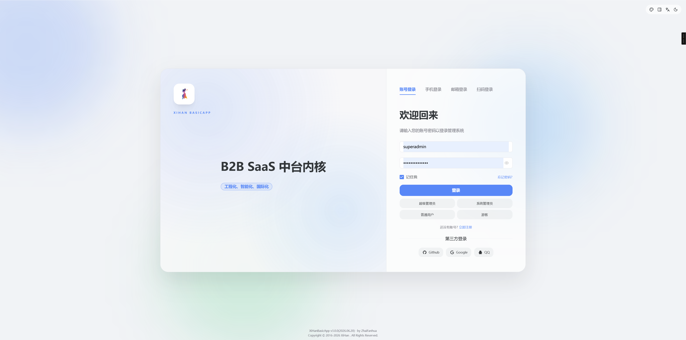
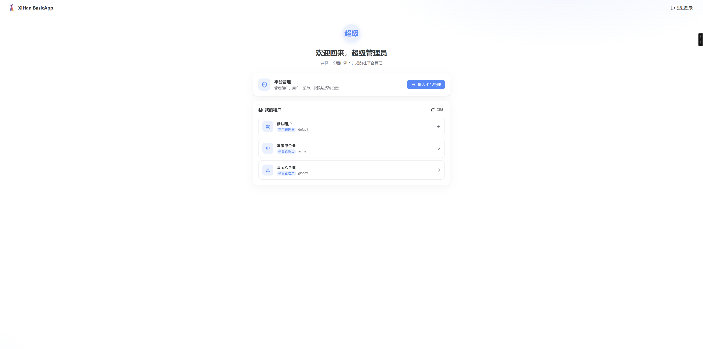
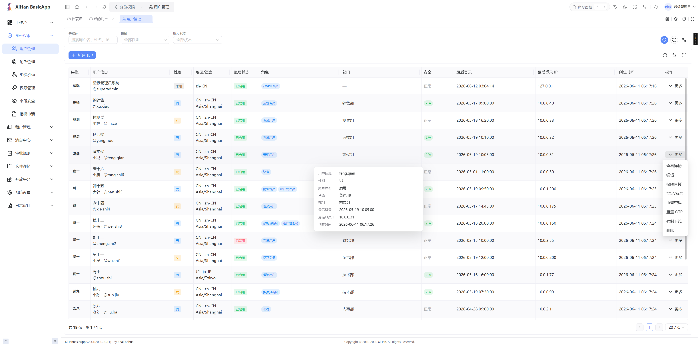
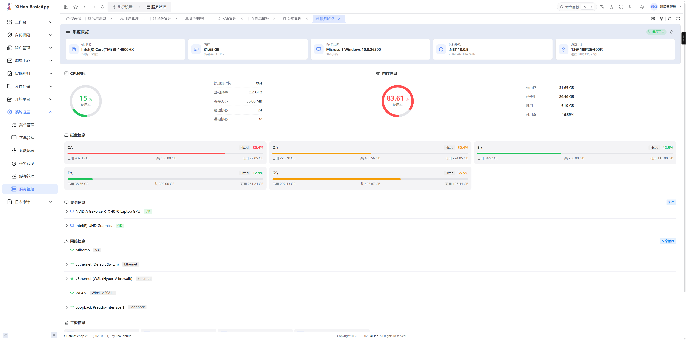
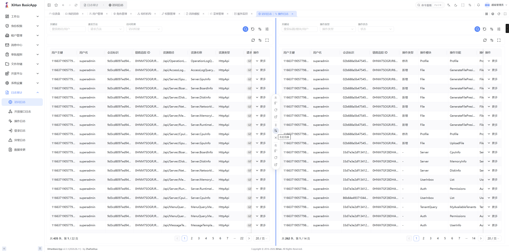
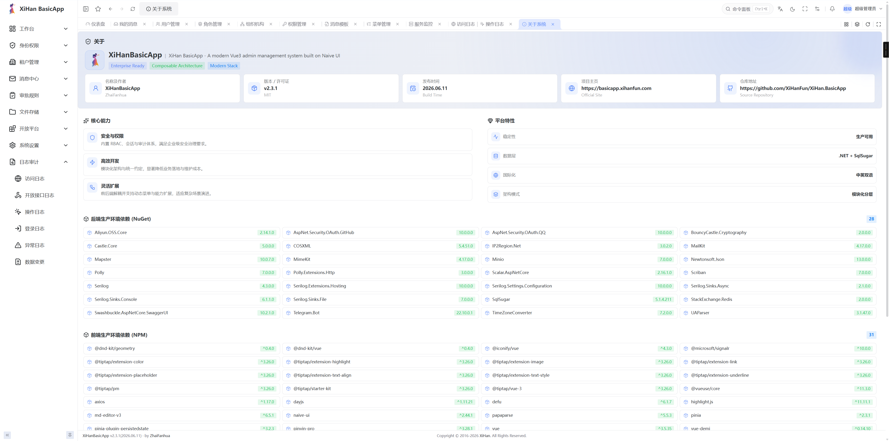

[](https://deepwiki.com/XiHanFun/XiHan.BasicApp)

QQ 交流群：[462371834](https://qm.qq.com/q/qYp1Urv3z2)

# XiHan.BasicApp

企业级中后台内核。后端基于 .NET 10 与 [XiHan.Framework](https://github.com/XiHanFun/XiHan.Framework)，前端基于 Vue 3，提供多租户、RBAC + ABAC 权限、代码生成与实时通信等能力。



## 简介

XiHan.BasicApp 采用前后端分离架构。后端遵循 DDD 分层与 CQRS，应用服务经动态 API 直接暴露为 REST 接口；前端使用 Vue 3 + TypeScript + Naive UI。系统内置完整的身份、权限、租户与审计能力，既可作为中后台项目的起点，也可作为 .NET + Vue 全栈实践的参考。

## 预览

<table>
  <tr>
    <td align="center"><br/>租户选择</td>
    <td align="center"><br/>用户管理</td>
  </tr>
  <tr>
    <td align="center"><br/>用户管理（暗色）</td>
    <td align="center"><br/>服务监控</td>
  </tr>
  <tr>
    <td align="center"><br/>偏好设置</td>
    <td align="center"><br/>操作日志</td>
  </tr>
  <tr>
    <td align="center"><br/>关于</td>
  </tr>
</table>


移动端：


## 功能

**身份与认证**

- 用户、角色、部门、菜单管理
- JWT 双令牌（Access + Refresh），多端登录与会话管理
- 多种登录方式：账号密码、邮箱 / 短信验证码、OAuth2（GitHub / Google / QQ）、2FA（TOTP / 邮箱 / 短信）
- 密码 PBKDF2 哈希；一次性验证码消费即销毁、恒定时间比较

**权限（RBAC + ABAC）**

- 权限码 `resource:action:scope`，超级管理员通配 `*:*:*`
- 角色层级继承（闭包表）、数据范围（本人 / 部门 / 租户）、字段级脱敏
- ABAC 约束规则（时间窗 / IP / 表达式）、会话角色激活（动态职责分离）
- 权限申请审批与变更留痕

**多租户**

- 字段级隔离，全局数据使用 `TenantId=0` 约定
- 邮箱全局唯一登录，登录后按归属自动落点（控制台 / 工作台 / 租户选择），可随时切换租户
- 超级管理员平台态运维，可切入任意租户代为管理
- 租户版本（Edition）权限白名单运行时门控；开通一站式建管理员、角色与授权；降级自动回收越权授权

**审计日志**

- 访问 / API / 操作 / 异常 / 登录 / 实体变更 六类日志，各自独立写入
- 落库前自动脱敏（密码、令牌、密钥、证件号等）；实体变更区分新增 / 修改 / 删除 / 恢复

**代码生成**

- 单表 / 树形 / 主从三种模式，从实体、DTO、API 到前端页面一键生成
- 基于 Scriban 模板，支持自定义；Zip 下载或直接写入文件

**平台能力**

- 动态 API：应用服务经 `[DynamicApi]` 暴露，无 Controller 样板，Scalar 文档自动生成
- 菜单单一事实源：后端 `PageRegistry` 统一注册菜单、路由、组件路径、权限码与国际化键
- 全链路分布式缓存（授权快照、版本门控、菜单、配置、字典），写路径精准失效
- 网关灰度发布（百分比 / 白名单 / 租户 / 请求头）、请求追踪、限流熔断
- 消息模板（邮件 / 短信 / 站内通知，Scriban 渲染，租户可覆盖默认）、SignalR 实时通知与在线聊天
- 文件多存储（本地 / S3 / OSS / COS / MinIO）、定时任务、审核工作流、国际化（中 / 英）

**前端体验**

- Schema 驱动列表页：搜索 / 表格 / 导出由配置生成，内置列设置、密度切换、高级搜索、个人视图保存、行悬停速览、树形模式与列宽拖拽
- 权限 / 租户 / 偏好感知：页面、字段、操作三级按权限码过滤，字段级脱敏；列设置与搜索偏好同步到后端，多端一致
- 灵动岛全局反馈、多标签页、收藏夹、命令面板式全局搜索
- 消息中心：顶部横幅、登录弹窗、通知中心，支持强制阅读与按角色 / 部门定向
- 偏好中心：亮 / 暗主题、主题色、布局风格与紧凑度，偏好云端同步
- 富文本（Tiptap）与 Markdown 编辑器、Cron 可视化、JSON 编辑 / 查看
- 锁屏、水印、时区切换、导入 / 导出中心（模板导入、异步导出任务）

## 技术栈

### 后端

| 技术 | 说明 |
| --- | --- |
| .NET 10 / C# | 运行时与语言 |
| XiHan.Framework 2.5.x | 自研模块化应用框架 |
| SqlSugar | ORM，支持 PostgreSQL / MySQL / MariaDB |
| Redis | 分布式缓存与分布式锁 |
| SignalR | 实时通信 |
| Serilog | 结构化日志 |
| Scalar | API 文档 |

### 前端

| 技术 | 说明 |
| --- | --- |
| Vue 3.5+ | UI 框架 |
| TypeScript 5.9+ | 类型系统 |
| Vite 6 | 构建工具 |
| Naive UI | 组件库 |
| Pinia | 状态管理 |
| Tailwind CSS 4 | 原子化 CSS |
| Tiptap | 富文本编辑器 |
| vue-i18n | 国际化 |

## 架构

系统分为框架层、模块层与主应用层，每个模块内部遵循 DDD 分层（Domain / Application / Infrastructure）。

```text
┌─────────────────────────────────────────────────────────────┐
│                   XiHan.BasicApp.WebHost                      │
│                   (启动入口与模块聚合)                          │
├──────────────────────────────┬──────────────────────────────┤
│  XiHan.BasicApp.Saas         │  XiHan.BasicApp.CodeGeneration│
│  (RBAC / 多租户 / 审计)       │  (代码生成与模板管理)           │
├──────────────────────────────┴──────────────────────────────┤
│                   XiHan.BasicApp.Web.Core                     │
│              (Web 核心能力 / 动态 API / 网关 / 灰度)            │
├─────────────────────────────────────────────────────────────┤
│                     XiHan.BasicApp.Core                       │
│               (基础应用能力 / DDD / CQRS / 模块化)             │
├─────────────────────────────────────────────────────────────┤
│                      XiHan.Framework.*                        │
│         底层框架(认证 / 授权 / 数据 / 缓存 / 事件总线 / 多租户)         │
└─────────────────────────────────────────────────────────────┘
```

| 项目 | 说明 |
| --- | --- |
| `XiHan.BasicApp.Core` | 基础应用能力，集成 DDD / CQRS / 事件总线 / 认证 / 授权 / 缓存 / 多租户 |
| `XiHan.BasicApp.Web.Core` | Web 核心能力，动态 API / Scalar / SignalR / 网关 / 灰度路由 |
| `XiHan.BasicApp.Saas` | 核心业务模块：用户 / 角色 / 权限 / 菜单 / 部门 / 租户 / 配置 / 字典 / 文件 / 通知 / 日志 / 任务 |
| `XiHan.BasicApp.CodeGeneration` | 代码生成：数据源管理 / 表结构导入 / 模板配置 / 全栈生成 |
| `XiHan.BasicApp.WebHost` | 启动入口，聚合所有模块 |

```text
XiHan.BasicApp/
├── backend/                 # 后端（.NET 10）
│   ├── src/
│   │   ├── framework/       #   Core / Web.Core 基础能力
│   │   ├── modules/         #   Saas、CodeGeneration 模块
│   │   └── main/            #   WebHost 启动入口
│   ├── props/               #   共享 MSBuild 属性
│   ├── scripts/             #   部署与运维脚本
│   └── test/                #   测试项目
├── frontend/                # 前端（Vue 3 + Naive UI）
│   ├── src/                 #   应用源码
│   └── packages/            #   内部包
└── assets/                  # README 资源
```

## 快速开始

### 环境要求

| 依赖 | 版本 |
| --- | --- |
| .NET SDK | 10.0+ |
| Node.js | 20.0+ |
| pnpm | 9.0+ |
| PostgreSQL | 14+（或 MySQL / MariaDB） |
| Redis | 6.0+ |

### 后端

```bash
git clone https://github.com/XiHanFun/XiHan.BasicApp.git
cd XiHan.BasicApp/backend

dotnet run --project src/main/XiHan.BasicApp.WebHost --launch-profile Development
```

启动后访问 `http://127.0.0.1:9708/scalar` 查看 API 文档。

各环境端口：Development `9708`、Production `9709`。

### 前端

```bash
cd frontend
pnpm install
pnpm dev
```

### 数据库

在 `backend/src/main/XiHan.BasicApp.WebHost/appsettings.Development.json` 配置连接串：

```json
{
  "XiHan": {
    "Data": {
      "SqlSugarCore": {
        "ConnectionConfigs": [
          {
            "DbType": "PostgreSQL",
            "ConnectionString": "Host=localhost;Port=5432;Database=xihan_basic_app;Username=postgres;Password=your_password;"
          }
        ]
      }
    }
  }
}
```

首次启动会自动建表并执行数据种子初始化。

### 默认账号

初始超级管理员账号为 `superadmin`，密码 `SuperAdmin@123`。可通过 `Saas:Seed:SuperAdminPassword`（环境变量 `Saas__Seed__SuperAdminPassword`）覆盖。生产环境请务必覆盖，并在首次登录后立即修改。

## 部署

### Linux（systemd）

```bash
dotnet publish backend/src/main/XiHan.BasicApp.WebHost -c Release -o /opt/xihan-basicapp

sudo cp backend/scripts/service/XiHan.BasicApp.service /etc/systemd/system/
sudo systemctl enable XiHan.BasicApp
sudo systemctl start XiHan.BasicApp
```

### Windows

使用 `backend/scripts/service/XiHan.BasicApp.bat` 启动。

## 版本

后端与前端当前版本：v2.3.1。

## 诚挚致谢

排名不分先后。

| 项目                                                         | 致谢                                           |
| ------------------------------------------------------------ | ---------------------------------------------- |
| [XiHan.Framework](https://github.com/XiHanFun/XiHan.Framework) | 作为本项目的后端底层框架支持                   |
| [NaiveUI](https://github.com/tusen-ai/naive-ui)              | 作为本项目的前端 UI 组件支持                   |
| [Blog.Core](https://github.com/anjoy8/Blog.Core)             | 作为部分后端架构、逻辑功能灵感来源（启蒙项目） |
| [Admin.NET](https://gitee.com/zuohuaijun/Admin.NET)          | 作为部分后端功能灵感来源                       |
| [ Admin.Core.ZR](https://gitee.com/izory/ZrAdminNetCore)     | 作为部分后端功能灵感来源                       |
| [YuebonCore](https://gitee.com/yuebon/YuebonNetCore)         | 作为部分后端功能灵感来源                       |
| [VbenAdmin](https://github.com/vbenjs/vue-vben-admin)        | 作为部分前端架构、视觉功能灵感来源（启蒙项目） |
| [SoybeanAdmin](https://github.com/soybeanjs/soybean-admin)   | 作为部分前端视觉功能灵感来源                   |
| [LitheAdmin](https://github.com/tenianon/lithe-admin)        | 作为部分前端视觉功能灵感来源                   |
| 其他第三方依赖                                               | 作为项目功能丰富与拓展的基石                   |

## 支持&赞助

如果此项目对你的开发有助益，也欢迎请作者一杯咖啡。

<table>
  <tr>
    <td align="center"><br/>支付宝</td>
    <td align="center"><br/>微信</td>
  </tr>
</table>

## 版权&授权

Copyright (c) 2026 XiHanFun and ZhaiFanhua

本项目采用 MIT 授权，详见 [License](./LICENSE)

XiHan.BasicApp Logo、XiHan.BasicApp名称、界面视觉设计与原创视觉表达归作者所有，第三方依赖和第三方服务分别遵循其各自授权与服务条款。

项目仅供学习参考，作者不承担任何软件的使用风险。
