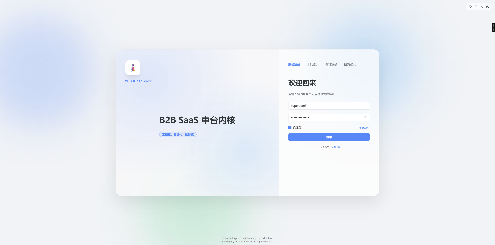
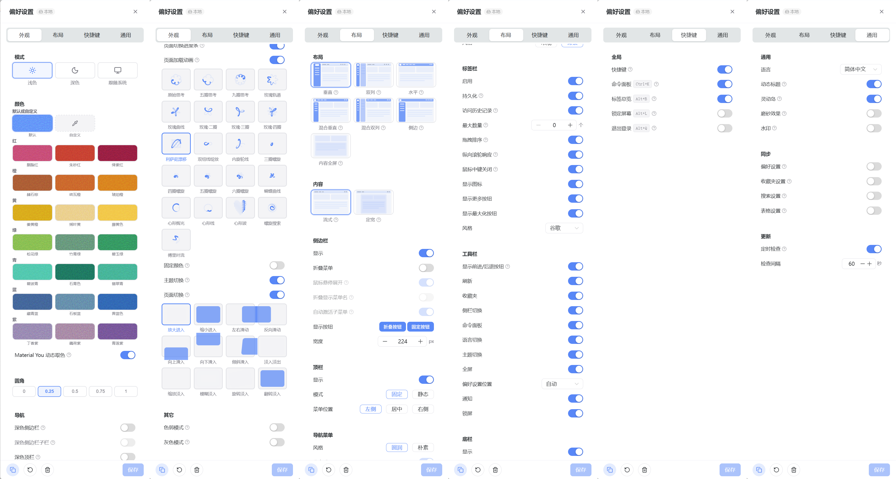
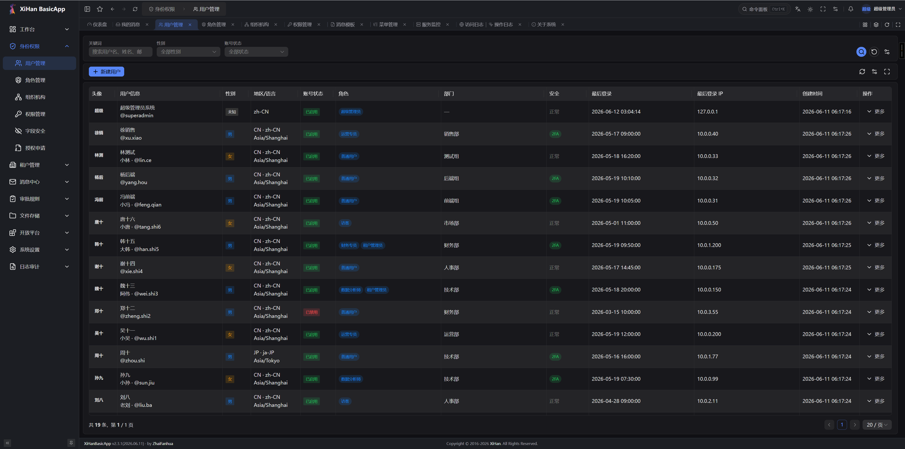
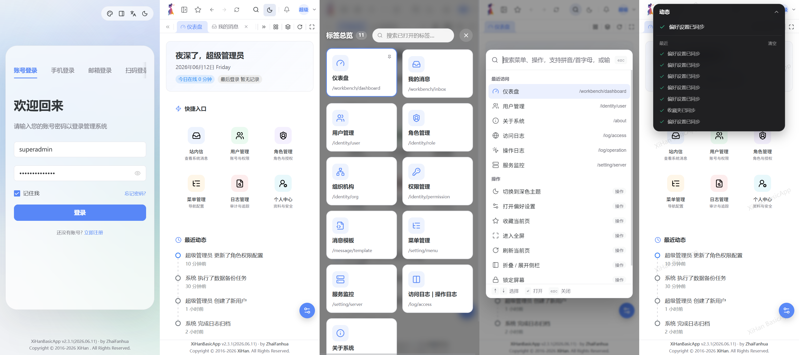

[](https://deepwiki.com/XiHanFun/XiHan.BasicApp)

[曦寒懿官方交流群](https://qm.qq.com/q/qYp1Urv3z2) 462371834

# XiHan.BasicApp

通用、全面的企业级管理系统，基于 [XiHan.Framework](https://github.com/XiHanFun/XiHan.Framework) 和 Vue 3 构建。



## 概述

XiHan.BasicApp 是一套完整的企业级后台管理解决方案，采用前后端分离架构。后端基于 .NET 10 与 XiHan.Framework，遵循 DDD 分层与 CQRS 模式；前端基于 Vue 3 + TypeScript + Naive UI。系统提供 RBAC + ABAC 混合权限管理、多租户隔离、代码生成、实时通信、灰度发布等核心能力，满足企业级后台管理场景。

## 设计目标

- 面向企业级后台管理场景的通用能力沉淀
- 统一模块边界与依赖关系，便于扩展与维护
- 以应用服务与动态 API 统一接口暴露方式
- 兼容多租户与分布式部署需求
- RBAC + ABAC 混合权限模型，支持细粒度访问控制
- 完善的审计日志体系，满足安全合规要求

## 速览

大屏






小屏



## 技术栈

### 后端

| 技术 | 说明 |
| --- | --- |
| .NET 10 / C# Latest | 运行时与语言 |
| XiHan.Framework 2.5.x | 自研模块化应用框架 |
| SqlSugar | ORM，支持 PostgreSQL / MySQL / MariaDB |
| Redis | 分布式缓存与分布式锁 |
| SignalR | 实时通信（通知推送、在线聊天） |
| Serilog | 结构化日志 |
| Scalar | API 文档 |
| Snowflake | 分布式 ID 生成 |
| ip2region | 离线 IP 地理定位 |

### 前端

| 技术 | 说明 |
| --- | --- |
| Vue 3.5+ | 渐进式 UI 框架 |
| TypeScript 5.9+ | 类型安全 |
| Vite 6 | 构建工具 |
| Naive UI | 组件库 |
| Pinia | 状态管理 |
| Vue Router 4 | 路由管理 |
| Tailwind CSS 3 | 原子化 CSS |
| VxeTable | 高性能表格组件 |
| Tiptap | 富文本编辑器 |
| vue-i18n | 国际化（中/英） |
| SignalR Client | 实时通信客户端 |

## 特色功能

- **登录后选租户**：邮箱全平台唯一作为登录身份，登录前无需预选租户。智能落点自动分流——平台账号进入控制中心、单租户用户直达工作台、多租户成员进入租户选择页，头像下拉随时切换租户。
- **平台态运维**：超级管理员以平台态（无租户上下文）管理租户、用户与全局数据，并可切入任意租户代为管理；平台级全局模板数据（`TenantId=0`）对所有租户只读可见。
- **套餐化租户版本**：版本（Edition）权限白名单在鉴权热路径运行时收窄有效权限（白名单缓存化，不增加查库开销）；租户开通一站式完成管理员账号、Owner 角色与按版本授权；套餐降级自动回收越界存量授权（置失效保留审计）。
- **动态 API**：应用服务经 `[DynamicApi]` 直接暴露为 REST 接口，零 Controller 样板代码，Scalar 文档自动生成。
- **菜单单一事实源**：后端 `PageRegistry` 统一注册菜单、路由、组件路径、权限码与国际化键，前后端契约永不漂移；菜单自带 I18nKey，原生支持后端菜单国际化。
- **消息模板服务**：邮件/短信/站内通知共用模板编码体系，Scriban 引擎渲染，租户可创建同编码模板覆盖全局默认；模板查询带分布式缓存与负缓存。
- **全链路缓存**：授权快照（用户 × 租户双维键）、版本门控、菜单路由、系统配置、字典树全部分布式缓存化，写路径经统一失效器精准失效，接入 Redis 即获横向扩展能力。
- **审计与脱敏**：六类日志独立写入器；请求体/查询串落日志前自动脱敏（密码、令牌、密钥、银行卡、身份证等）；数据变更日志识别软删除语义，区分新增/修改/删除/恢复。
- **安全工程化**：全链路加密安全随机数；一次性验证码分布式存储、消费即销毁、恒定时间比较防时序攻击；OAuth2 客户端注册管理与内建客户端种子。
- **全栈代码生成**：单表/树形/主从三种模式，从实体、DTO、API 到前端页面一键生成，支持模板自定义。
- **网关级灰度发布**：百分比、用户白名单、租户、请求头四种规则，配合请求追踪与限流熔断。

## 架构概览

系统整体分为框架层、功能模块层与主应用层：

- **框架层**：提供基础应用能力与 Web 管道能力
- **模块层**：承载 RBAC/SaaS、代码生成等通用模块
- **主应用层**：组合模块并提供 WebHost 启动入口

```text
┌─────────────────────────────────────────────────────────────┐
│                     XiHan.BasicApp.WebHost                  │
│                      (应用启动入口与模块聚合)                  │
├─────────────────────────────┬───────────────────────────────┤
│  XiHan.BasicApp.Saas        │  XiHan.BasicApp.CodeGeneration│
│  (RBAC/多租户/审计模块)      │  (代码生成与模板管理模块)       │
├─────────────────────────────┴───────────────────────────────┤
│                  XiHan.BasicApp.Web.Core                    │
│               (Web 核心能力与管道扩展/网关/灰度)              │
├─────────────────────────────────────────────────────────────┤
│                    XiHan.BasicApp.Core                      │
│              (基础应用层能力/DDD/CQRS/模块化支持)             │
├─────────────────────────────────────────────────────────────┤
│                    XiHan.Framework.*                        │
│          (认证/授权/数据/缓存/事件总线/多租户/AI/...)          │
└─────────────────────────────────────────────────────────────┘
```

### DDD 分层结构

每个功能模块内部遵循 DDD 分层：

```text
Module/
├── Domain/                    # 领域层
│   ├── Entities/              #   实体与聚合根
│   ├── DomainServices/        #   领域服务
│   ├── Repositories/          #   仓储接口
│   ├── Events/                #   领域事件
│   ├── Enums/                 #   枚举
│   ├── Specifications/        #   规约
│   └── ValueObjects/          #   值对象
├── Application/               # 应用层
│   ├── AppServices/           #   应用服务（写端）
│   ├── QueryServices/         #   查询服务（读端，CQRS）
│   ├── UseCases/              #   命令与查询对象
│   ├── Dtos/                  #   数据传输对象
│   └── Caching/               #   缓存服务
├── Infrastructure/            # 基础设施层
│   ├── Repositories/          #   仓储实现（SqlSugar）
│   ├── Authentication/        #   认证适配器
│   ├── Authorization/         #   授权适配器（RBAC/ABAC）
│   └── Logging/               #   日志写入器
├── Hubs/                      # SignalR 实时通信
├── Seeders/                   # 数据种子
└── Tasks/                     # 后台任务
```

## 项目结构

```text
XiHan.BasicApp/
├── backend/                            # 后端
│   ├── XiHan.BasicApp.slnx            #   解决方案文件
│   ├── src/
│   │   ├── framework/
│   │   │   ├── XiHan.BasicApp.Core/           # 基础应用层能力
│   │   │   └── XiHan.BasicApp.Web.Core/       # Web 核心能力
│   │   ├── modules/
│   │   │   ├── XiHan.BasicApp.Saas/           # RBAC/SaaS 模块
│   │   │   └── XiHan.BasicApp.CodeGeneration/ # 代码生成模块
│   │   └── main/
│   │       └── XiHan.BasicApp.WebHost/        # 启动入口
│   ├── docs/                          #   架构设计文档
│   ├── props/                         #   共享 MSBuild 属性
│   ├── scripts/                       #   部署与运维脚本
│   └── test/                          #   测试项目
├── frontend/                           # 前端（Vue 3 + Naive UI）
│   ├── src/                           #   前端源码
│   ├── packages/                      #   内部包
│   └── public/                        #   静态资源
├── docs/                               # 项目文档
└── assets/                             # README 资源文件
```

## 模块清单

| 模块/项目 | 说明 |
| --- | --- |
| `XiHan.BasicApp.Core` | 基础应用层能力，集成 DDD/CQRS/事件总线/认证/授权/缓存/多租户/分布式 ID 等框架模块 |
| `XiHan.BasicApp.Web.Core` | Web 核心能力，集成动态 API/Scalar 文档/SignalR/网关/灰度路由/请求追踪 |
| `XiHan.BasicApp.Saas` | 核心业务模块：用户/角色/权限/菜单/部门/租户/配置/字典/文件/通知/消息/日志/任务/审核/OAuth |
| `XiHan.BasicApp.CodeGeneration` | 代码生成模块：数据源管理/表结构导入/模板配置/全栈代码生成/生成历史 |
| `XiHan.BasicApp.WebHost` | 应用启动入口，聚合所有模块并提供 WebHost 配置 |

## 核心功能

### 权限管理（RBAC + ABAC）

- 用户、角色、权限、菜单的完整 CRUD 管理
- 角色层级继承（闭包表实现）
- ABAC 约束规则（基于时间窗/IP/角色/自定义表达式）
- 数据权限范围控制（仅本人/本部门/本租户等）
- 字段级安全控制
- 会话角色激活（动态职责分离 DSD）
- 权限码格式：`resource:action:scope`，超级管理员通配符 `*:*:*`

### 认证体系

- JWT 双令牌（Access Token + Refresh Token）
- 密码哈希（SHA256，600,000 次迭代，PBKDF2 风格）
- OAuth2 社交登录（GitHub / Google / QQ）
- 双因子认证（2FA：TOTP / 邮箱 / 短信）
- 邮箱验证码登录（一次性验证码：分布式存储、消费即销毁、防时序攻击）
- 手机号/短信验证码登录
- 找回密码（临时密码邮件）与注册欢迎邮件（模板渲染）
- 多端登录控制与会话管理

### 多租户

- 字段级租户隔离，全局数据使用 `TenantId=0` 约定（租户可见自有数据与全局模板）
- 邮箱全平台唯一登录，登录后智能落点（控制中心 / 直进工作台 / 租户选择）
- 租户切换（SwitchTenant）与超管平台态运维
- 租户版本（Edition）、权限白名单与运行时门控（白名单缓存化）
- 租户开通一站式：管理员账号 + Owner 角色 + 按版本白名单授权
- 套餐降级/白名单收窄自动回收越界存量授权

### 审计日志

系统提供六类日志，各配有独立写入器：

| 日志类型 | 说明 |
| --- | --- |
| 访问日志 | HTTP 请求记录 |
| API 日志 | 接口调用记录 |
| 操作日志 | 业务操作审计 |
| 异常日志 | 错误与异常捕获 |
| 登录日志 | 登录事件与认证安全审计（令牌刷新/密码修改/重置/MFA 绑定解绑） |
| 实体审计 | 数据变更追踪（字段级，识别软删除语义：新增/修改/删除/恢复） |

- 请求体/查询串落日志前自动脱敏（密码、令牌、密钥、银行卡、身份证等）
- 操作日志只记录业务写操作，查询类请求不产生审计噪音

### 实时通信

- 通知推送 Hub（系统通知实时下发）
- 在线聊天 Hub

### 代码生成

- 数据源管理与表结构导入
- 模板配置与自定义
- 支持单表/树形/主从表三种生成模式
- 支持 Zip 下载或直接写入文件
- 全栈生成：实体、DTO、API、前端页面

### 网关能力

- 灰度发布（百分比/用户白名单/租户/请求头四种规则）
- 请求追踪
- 限流与熔断
- OpenAPI 安全（HMAC-SHA256 签名/AES-CBC 加密/防重放）

### 其他功能

- 部门/组织架构管理
- 系统配置与字典管理（分布式缓存 + 写路径失效）
- 文件上传与多存储管理（本地 / S3 / OSS / COS / MinIO，按类别路由）
- 消息模板管理（邮件/短信/通知模板，Scriban 渲染，租户可覆盖全局默认）
- 邮件与短信发送（模板优先、内置内容兜底、失败重试）
- 定时任务管理
- 审核工作流
- 系统版本升级与迁移
- 服务器信息与健康检查
- 国际化（中文/英文）

## 快速开始

### 环境要求

| 依赖 | 版本要求 |
| --- | --- |
| .NET SDK | 10.0+ |
| Node.js | 20.0+ |
| pnpm | 9.0+ |
| PostgreSQL | 14+ (推荐) 或 MySQL / MariaDB |
| Redis | 6.0+ |

### 后端启动

```bash
# 克隆仓库
git clone https://github.com/XiHanFun/XiHan.BasicApp.git
cd XiHan.BasicApp

# 进入后端目录
cd backend

# 还原依赖并启动（Development 模式）
dotnet run --project src/main/XiHan.BasicApp.WebHost --launch-profile Development
```

启动后访问 `http://127.0.0.1:9708/scalar` 查看 API 文档。

**启动代码示例：**

```csharp
using XiHan.Framework.Core.Extensions.DependencyInjection;
using XiHan.BasicApp.WebHost;

var builder = WebApplication.CreateBuilder(args);
await builder.AddApplicationAsync<XiHanBasicAppWebHostModule>();

var app = builder.Build();
await app.InitializeApplicationAsync();
await app.RunAsync();
```

### 前端启动

```bash
# 进入前端目录
cd frontend

# 安装依赖
pnpm install

# 开发模式启动
pnpm dev
```

### 启动配置

| 环境 | 端口 | 说明 |
| --- | --- | --- |
| Test | 9707 | 测试环境 |
| Development | 9708 | 开发环境 |
| Production | 9709 | 生产环境 |

### 数据库配置

在 `backend/src/main/XiHan.BasicApp.WebHost/appsettings.Development.json` 中配置数据库连接：

```json
{
  "XiHan": {
    "Data": {
      "SqlSugarCore": {
        "ConnectionConfigs": [
          {
            "DbType": "PostgreSQL",
            "ConnectionString": "Host=localhost;Port=5432;Database=xihan_basic_app;Username=postgres;Password=your_password;"
          }
        ]
      }
    }
  }
}
```

系统首次启动会自动创建表结构并执行数据种子初始化。

### 默认账号

默认超级管理员账号为 `superadmin`，初始密码 `SuperAdmin@123`。可通过配置 `Saas:Seed:SuperAdminPassword`（环境变量 `Saas__Seed__SuperAdminPassword`）覆盖初始密码；**生产环境请务必覆盖，并在首次登录后立即修改**。

## 部署

### Linux (systemd)

项目提供了 systemd 服务配置文件，位于 `backend/scripts/service/XiHan.BasicApp.service`。

```bash
# 发布
dotnet publish backend/src/main/XiHan.BasicApp.WebHost -c Release -o /opt/xihan-basicapp

# 配置并启动服务
sudo cp backend/scripts/service/XiHan.BasicApp.service /etc/systemd/system/
sudo systemctl enable XiHan.BasicApp
sudo systemctl start XiHan.BasicApp
```

### Windows

使用 `backend/scripts/service/XiHan.BasicApp.bat` 启动。

## 项目版本

- 后端版本：v2.2.0
- 前端版本：v1.2.1

## 开源协议

[MIT License](./LICENSE) - Copyright (c) 2021-Present XiHanFun and ZhaiFanhua
