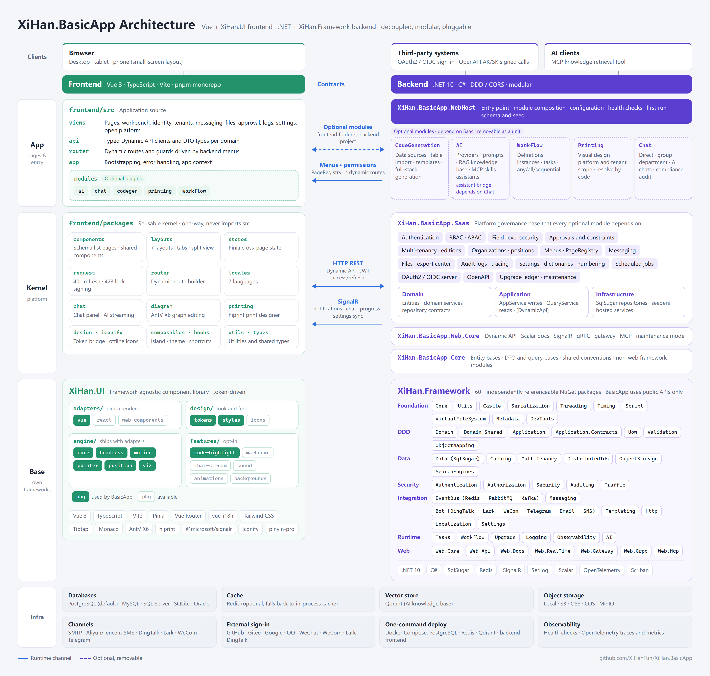

<div align="center">


<h1>XiHan.BasicApp</h1>

<p><b>A beautifully crafted general-purpose admin kernel built on XiHan.Framework and XiHan.UI</b></p>

<p>A .NET backend on <a href="https://github.com/XiHanFun/XiHan.Framework">XiHan.Framework</a>, a Vue frontend on <a href="https://github.com/XiHanFun/XiHan.UI">XiHan.UI</a><br/>Multi-tenancy · RBAC with data scopes and field masking · Code generation · Realtime</p>

<p><b>English</b> | <a href="./README_cn.md">简体中文</a></p>

<p>
  <a href="https://github.com/XiHanFun/XiHan.BasicApp/stargazers"></a>
  <a href="https://gitee.com/XiHanFun/XiHan.BasicApp"></a>
  <a href="https://gitcode.com/XiHanFun/XiHan.BasicApp"></a>
</p>


<p>
  
  <a href="https://github.com/XiHanFun/XiHan.Framework"></a>
  
  
  
  
  <a href="https://www.nuget.org/packages?q=XiHan.BasicApp"></a>
</p>

<p>
  <a href="./LICENSE"></a>
  <a href="https://github.com/XiHanFun/XiHan.BasicApp/commits"></a>
  
  <a href="https://github.com/XiHanFun/XiHan.BasicApp/issues"></a>
  <a href="https://github.com/XiHanFun/XiHan.BasicApp/graphs/contributors"></a>
  
</p>

<p>
  <a href="https://deepwiki.com/XiHanFun/XiHan.BasicApp"></a>
  <a href="https://basicapp.docs.xihanfun.com"></a>
  <a href="https://qm.qq.com/q/qYp1Urv3z2"></a>
</p>
<p>
  <a href="https://trendshift.io/repositories/83127?utm_source=trendshift-badge&amp;utm_medium=badge&amp;utm_campaign=badge-trendshift-83127" target="_blank" rel="noopener noreferrer"></a>
</p>


</div>

## Introduction

XiHan.BasicApp is a decoupled frontend/backend system. The backend follows DDD layering — writes go through application services, reads through query services — and application services are exposed directly as REST endpoints by the dynamic API convention. The frontend is Vue + TypeScript + XiHan.UI, and the backend .NET + XiHan.Framework. Identity, permissions, tenancy and auditing are built in, so it works both as the starting point for an admin project and as a reference for full-stack .NET + Vue practice. XiHan.BasicApp is the basic application of the XiHanFun open-source ecosystem.

## Documentation

| Destination | Contents |
| --- | --- |
| [Documentation site](https://basicapp.docs.xihanfun.com) | Full guides and topic-by-topic documentation |
| [Backend engineering notes](./backend/README.md) | Structure, project catalog, endpoint exposure, dependencies, local development |
| [Frontend engineering notes](./frontend/README.md) | Stack, monorepo structure, architectural constraints, local development |

## Preview

The shots illustrate the [highlights](#highlights); to try it hands-on, open the [live demo](https://basicapp.xihanfun.com).

<table>
  <tr>
    <td align="center" width="50%"><a href="./assets/preview/theme-light-dark.png"></a><br/><b>Light and dark themes</b><br/>Every page and component color-checked in both</td>
    <td align="center" width="50%"><a href="./assets/preview/theme-colors.png"></a><br/><b>One color, a full palette</b><br/>Material You dynamic color and 21 traditional Chinese presets</td>
  </tr>
  <tr>
    <td align="center" colspan="2"><a href="./assets/preview/preference-center.png"></a><br/><b>Preference center</b><br/>Layout, color, density, shortcuts and cloud sync in one place, applied live on your other devices</td>
  </tr>
  <tr>
    <td align="center" width="50%"><a href="./assets/preview/schema-list.png"></a><br/><b>Schema-driven list pages</b><br/>Hover previews, advanced search and column settings out of the box</td>
    <td align="center" width="50%"><a href="./assets/preview/command-palette.png"></a><br/><b>Command palette search</b><br/><code>Ctrl / ⌘ + K</code>, with pinyin initials, straight to pages and actions</td>
  </tr>
  <tr>
    <td align="center" width="50%"><a href="./assets/preview/split-view.png"></a><br/><b>In-app split view</b><br/>Two pages side by side, swapped without reloading</td>
    <td align="center" width="50%"><a href="./assets/preview/control-center.png"></a><br/><b>Multi-tenant control center</b><br/>Switch between platform administration and tenants in one place</td>
  </tr>
  <tr>
    <td align="center" colspan="2"><a href="./assets/preview/mobile.png"></a><br/><b>Small screens</b><br/>Sign-in, dashboard, drawer menu, command palette and Dynamic Island, ready in a phone browser</td>
  </tr>
  <tr>
    <td align="center" width="50%"><a href="./assets/preview/dashboard.png"></a><br/><b>Dashboard</b><br/>Drag widgets into place, with the board layout saved to the cloud</td>
    <td align="center" width="50%"><a href="./assets/preview/log-trace.png"></a><br/><b>One TraceId, the whole story</b><br/>Seven log types on one timeline, with a Sankey view of the flow</td>
  </tr>
</table>

## Highlights

Close to 90 tables, more than 50 pages and over 300 permission codes come built in. This section covers only what sets the project apart; the page-by-page capability list lives in the [feature list](https://basicapp.docs.xihanfun.com/features) on the docs site (Chinese). AI, chat, code generation, workflow and printing are optional modules.

### Experience

- **Light and dark themes**: Not a class toggled at the root — every page and every component has been color-checked in both; switching ripples out from the point you clicked
- **One color, a full palette**: 21 traditional Chinese color presets plus any custom color; Material You dynamic color derives secondary, container and tinted neutral tones from the brand color, so changing it takes no CSS edits
- **Preference center**: Tune 7 layouts, corner radius, density, font size, tab style, page transitions and watermark; preferences, column settings, search habits and dashboard boards sync to the cloud and apply live on your other devices
- **Dynamic Island feedback**: Borrowed from phones — sign-in, uploads, exports, server-side task progress and reconnects gather in a small island at the top, with progress rings and retry buttons inside, instead of a screen full of toasts
- **Schema-driven list pages**: Nearly 50 list pages are generated from one field schema each, with column settings, advanced search, multi-column sorting, hover row previews, tree mode, column resizing and import/export out of the box
- **Command palette search**: Press `Ctrl / ⌘ + K` for fuzzy matching (including Chinese pinyin and initials) that jumps to any page you can access, or runs actions such as switching theme, locking the screen or favoriting the current page
- **In-app split view**: Put two pages side by side and swap them without reloading; pin and drag tabs, and press `Alt + B` for a searchable tab overview
- **Small screens**: On narrow viewports the sidebar becomes a drawer, action buttons collapse to icons and chat switches to a single pane, so it works in a phone browser
- **Motion with an origin**: Dialogs grow out of the button or row that opened them, favorited tabs fly into the favorites bar, and all of it switches off when the OS asks for reduced motion
- **Languages and time zones**: 7 languages (Simplified and Traditional Chinese, English, Japanese, Korean, Hindi, German) across frontend and backend, with times shown in each user's chosen time zone

### Access and security

- **The server owns the session**: Every request reads a server-side permission snapshot instead of trusting token claims, so revocations and forced sign-outs take effect at once; a locked screen answers every request with 423 and resumes after unlocking, no new sign-in needed
- **Field-level security**: Control read, edit and masking (hidden, full mask, partial mask, hash, redact) per role, user or department, enforced on the server and in exports; masked fields cannot be sorted or filtered, so their values cannot be inferred from result order
- **Role inheritance and separation of duties**: Only direct inheritance edges are stored and the full graph is derived, with parent denies flowing down; static separation of duties is checked on role assignment, inheritance changes and request approval, and conflicts are blocked
- **Time-boxed delegation and access requests**: Delegations must carry an expiry and can be revoked at any time; approved requests grant the role or permission automatically
- **Impersonation with guardrails**: A reason is required, sessions expire after 30 minutes by default, high-risk permissions are blocked, everything is audited and a banner stays on screen
- **Authentication, fully stocked**: Passwords, email and SMS codes, TOTP two-factor, 8 external providers (GitHub, Gitee, Google, QQ, WeChat, WeCom, Feishu, DingTalk), and throttling per account + IP and per IP
- **Built-in OAuth2 / OIDC server**: Authorization code with PKCE, token revocation, discovery and JWKS make it a single sign-on hub for your other systems; OpenAPI callers get AK / SK signed credentials
- **One source for menus, routes and permission codes**: The backend PageRegistry declares pages, routes, components, permission codes and buttons in one place; menu seeds and frontend routes derive from it, and tests check that both sides agree

### Multi-tenancy

- **Two isolation modes**: Field-level isolation by default, or a dedicated database for any single tenant (PostgreSQL, MySQL, SQL Server, SQLite or Oracle), provisioned step by step together with its administrator
- **Global data that tenants cannot overwrite**: Platform rows use `TenantId = 0`; tenants can read but not write them, enforced by a write guard in the framework data layer
- **Editions you can sell**: Free, basic, professional and enterprise editions gate features with permission allowlists, and downgrades revoke out-of-range grants automatically; seat and storage quotas are enforced when adding members and uploading files
- **Platform-side operations**: Assign support members into tenants, transfer tenant ownership, and let a background job disable tenants when they expire

### Audit and operations

- **Seven audit log types**: Access, OpenAPI, operation, exception, sign-in, data change and permission change, with passwords and tokens masked before storage, monthly table splitting and scheduled cleanup
- **One TraceId, the whole story**: All seven log types line up on one timeline by TraceId, session, user or IP, with a Sankey diagram for flow and a stacked chart for time distribution
- **Field-by-field change history**: Creates, updates, deletes and restores record before-and-after values and a risk level
- **Reliable message delivery**: Combine in-app, email, SMS and bot channels freely, with per-tenant template overrides; an outbox with atomic claiming, retries and crash recovery, plus SignalR real-time push
- **Exports that respect permissions**: The export center runs in the background as the requesting user, so field masking still applies, and progress streams back to the Dynamic Island
- **Business numbers without duplicates**: Idempotency keys and request fingerprints prevent double allocation, optimistic locking keeps concurrency safe, with batch allocation and time-zone-aware resets
- **Upgrades with a ledger**: Forward SQL scripts record status, duration and errors per version and per database, while maintenance mode answers 503 with `Retry-After` during upgrades

### Optional modules

- **Keep only what you need**: AI, chat, code generation, workflow and printing are each one backend project paired with one frontend directory, removable as a unit (see [Removing optional modules](#removing-optional-modules))
- **Code generation**: Single-table, tree and master-detail modes produce entities, DTOs, APIs and frontend pages in one pass, plus permission codes, menus, export providers and print data sources; generated and hand-written code live in separate files, so regenerating never overwrites your edits
- **Workflow**: A visual designer on AntV X6 with 16 node types, any-of, all-of and sequential approval, reassignment and added signers; state is persisted and recovers after crashes, and instance graphs color each node by status
- **Print designer**: Drag in fields and bind backend data sources and sample data for WYSIWYG templates; silent direct printing works with the desktop client
- **Online chat**: Direct, group and department chats with recall, edit, reply, @mentions, reactions, group read receipts, voice messages and sensitive-word blocking, plus a streaming AI assistant and a compliance audit view
- **AI knowledge base**: RAG on Qdrant with source citations and tenant isolation; model providers are managed as data and can be hot-swapped

### Engineering foundation

- **No controllers**: More than 150 application services are exposed as REST through Dynamic API, with writes in AppServices and reads in QueryServices, documented live in Scalar
- **Architecture rules backed by tests**: Over 2,700 tests, including structural ones that check which database each entity lives in, whether unique indexes include tenant scope, and that no page hard-codes a permission code
- **A foundation you can take with you**: The backend foundation, XiHan.Framework, ships as over 60 independently referenceable NuGet packages and BasicApp uses only public APIs, so you can launch on the template and replace it piece by piece

## Tech Stack

Backend: .NET with XiHan.Framework (SqlSugar, Redis, SignalR, Serilog and Scalar all arrive through the framework). Frontend: Vue + TypeScript + Vite + XiHan.UI + Pinia + Tailwind CSS.

Item-by-item lists live in the [backend](./backend/README.md#dependency-footprint) and [frontend](./frontend/README.md#stack) engineering notes.

## Architecture

Frontend and backend each split into three aligned layers: the app layer holds pages and entry points, the kernel layer holds platform capabilities, and the base layer is the in-house XiHan.UI and XiHan.Framework. Each backend module follows DDD layering internally (Domain / Application / Infrastructure), and the two sides cooperate through Dynamic API, SignalR, and the menus and permission codes the backend publishes.

<p align="center"><a href="./assets/architecture.png"></a></p>

Backend projects:

| Project | Description | Removable |
| --- | --- | --- |
| `XiHan.BasicApp.Core` | Application base composing the non-web framework modules and shared conventions | No |
| `XiHan.BasicApp.Web.Core` | Web base composing the framework web modules, provides the maintenance-mode middleware | No |
| `XiHan.BasicApp.Saas` | Platform governance: users / roles / permissions / menus / departments / tenants / settings / dictionaries / files / notifications / approvals / logs / jobs | No |
| `XiHan.BasicApp.CodeGeneration` | Code generation: data sources / schema import / template configuration / full-stack output | Yes |
| `XiHan.BasicApp.AI` | AI: providers and key custody / prompt library / knowledge-base RAG / skills as MCP tools / chat assistant | Yes (the assistant bridge depends on Chat) |
| `XiHan.BasicApp.Workflow` | Workflow: definitions / instances / todos — persistence and APIs over the framework engine | Yes |
| `XiHan.BasicApp.Printing` | Print templates: visual design / tenant and platform scopes / resolution by code | Yes |
| `XiHan.BasicApp.Chat` | Chat: direct / group / department / assistant conversations, realtime delivery, compliance auditing | Yes (also handle the AI assistant bridge) |
| `XiHan.BasicApp.WebHost` | Startup host composing every module | — |

```text
XiHan.BasicApp/
├── backend/                 # backend (.NET)
│   ├── src/
│   │   ├── framework/       #   Core / Web.Core base capabilities
│   │   ├── modules/         #   Saas + optional modules (CodeGen/AI/Workflow/Printing/Chat)
│   │   └── main/            #   WebHost startup entry
│   ├── props/               #   shared MSBuild properties
│   ├── scripts/             #   version bump and cleanup scripts
│   └── test/                #   test projects
├── frontend/                # frontend (Vue + XiHan.UI)
│   ├── src/                 #   application sources (src/modules/ mirrors the optional backend modules)
│   └── packages/            #   internal packages
└── assets/                  # Branding and README assets
    ├── architecture.html    # Architecture diagram source (exports architecture*.png)
    └── preview/             # Feature screenshots
```

### Removing Optional Modules

An optional module is one backend project plus one `src/modules/<module>` directory on the frontend. The per-side steps live in the [backend](./backend/README.md#removing-optional-modules) and [frontend](./frontend/README.md#removing-optional-modules) engineering notes.

⚠️ **Removal must be paired with rebuilding the database**: seeded menus, permissions, role grants and scheduled jobs are not reclaimed when a module is deleted.

## Getting Started

### Requirements

| Dependency | Version | Notes |
| --- | --- | --- |
| .NET SDK | 10.0+ | required by the backend |
| Node.js | 24.0+ | required by the frontend |
| pnpm | 11.0+ | required by the frontend |
| PostgreSQL | 14+ | the only hard requirement; MySQL / SQL Server / SQLite / Oracle also work |
| Redis | 6.0+ | optional; falls back to in-process memory caching when disabled |
| Qdrant | v1.15+ | only needed for the AI knowledge base |

### One Command with Containers

The repository root ships a `docker-compose.yml` with five services — PostgreSQL, Redis, Qdrant, backend and frontend:

```bash
cp .env.example .env
docker compose up -d
```

The frontend defaults to `http://localhost:8080` and the backend to `http://localhost:9708`; both ports are configurable in `.env`.

### Backend

```bash
git clone https://github.com/XiHanFun/XiHan.BasicApp.git
cd XiHan.BasicApp/backend

dotnet run --project src/main/XiHan.BasicApp.WebHost --launch-profile Development
```

Then open `http://127.0.0.1:9708/scalar` for the API documentation. Ports per environment: Development `9708`, Production `9709`.

The connection string goes into `XiHan:Data:SqlSugarCore:ConnectionConfigs` in `backend/src/main/XiHan.BasicApp.WebHost/appsettings.Development.json`. The first start creates the schema and seeds it automatically.

The framework is consumed from NuGet by default, so cloning this repository alone is enough to build. See the [backend engineering notes](./backend/README.md#how-the-framework-is-referenced) for working on the framework at the same time.

### Frontend

```bash
cd frontend
pnpm install
pnpm dev
```

> `@xihan-ui/*` comes from the published npm releases, so cloning this repository on its own and running `pnpm install` just works — no sibling `XiHan.UI` checkout required. To debug against the component library sources, temporarily add an `overrides` block in `pnpm-workspace.yaml` pointing at `link:../../XiHan.UI/ui/packages/*`, then remove it; do not commit it.

### Default Account

The initial super administrator is `superadmin` with the password `SuperAdmin@123` (written by the seed; the account is flagged as needing its own password change). In production, change it right after the first sign-in and consider turning on forced password change in the "Password settings" parameter.

The development configuration turns on demo data (`Saas:Seed:EnableDemoData`): demo tenants and accounts covering every edition, tenant status, member type, data scope and account state, all with the password `Demo@123`. See [Introduction: seed data](docs/backend/introduction.md#演示数据) for the list.

## Ecosystem

- [XiHan.Framework](https://github.com/XiHanFun/XiHan.Framework) - A fast, lightweight, efficient and thoughtfully built modern modular framework for .NET
- [XiHan.UI](https://github.com/XiHanFun/XiHan.UI) - A fast, lightweight, efficient and thoughtfully built framework-agnostic component library
- [XiHan.BasicApp](https://github.com/XiHanFun/XiHan.BasicApp) - A beautifully crafted admin kernel built on .NET and Vue

## Acknowledgements

In no particular order.

| Project                                                        | Thanks for                                              |
| -------------------------------------------------------------- | ------------------------------------------------------- |
| [XiHan.Framework](https://github.com/XiHanFun/XiHan.Framework) | Being the backend foundation of this project            |
| [XiHan.UI](https://github.com/XiHanFun/XiHan.UI)               | Being the frontend component foundation of this project |
| [NaiveUI](https://github.com/tusen-ai/naive-ui)                | The frontend component library before v4.0.0            |
| [Blog.Core](https://github.com/anjoy8/Blog.Core)               | Inspiring parts of the backend architecture             |
| [ Admin.Core.ZR](https://gitee.com/izory/ZrAdminNetCore)       | Inspiring parts of the backend features                 |
| [YuebonCore](https://gitee.com/yuebon/YuebonNetCore)           | Inspiring parts of the backend features                 |
| [VbenAdmin](https://github.com/vbenjs/vue-vben-admin)          | Inspiring parts of the frontend architecture and visuals |
| [SoybeanAdmin](https://github.com/soybeanjs/soybean-admin)     | Inspiring parts of the frontend visuals                 |
| [LitheAdmin](https://github.com/tenianon/lithe-admin)          | Inspiring parts of the frontend visuals                 |
| Other third-party dependencies                                 | Being the foundation this project is built upon         |


## Support & Sponsorship

If this project helps your work, feel free to buy the author a coffee.

Official sponsorship page: https://docs.xihanfun.com/cosmos/sponsor


## License

Copyright (c) 2021-Present XiHanFun and contributors.

Released under the MIT License — see [License](./LICENSE).

The XiHan.BasicApp logo, name, interface visual design and original visual expression belong to the author; third-party dependencies and services are governed by their own licenses and terms.

This project is provided for study and reference; the author assumes no liability for any use of the software.
