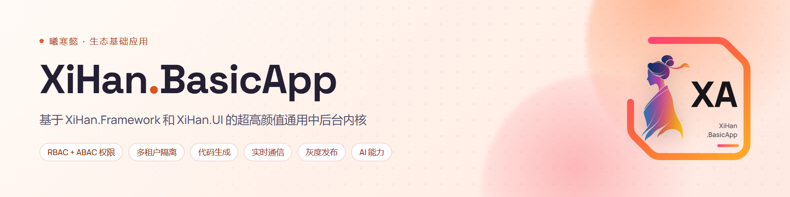
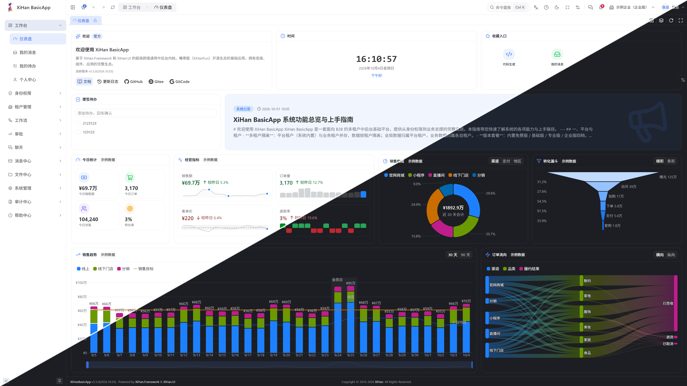
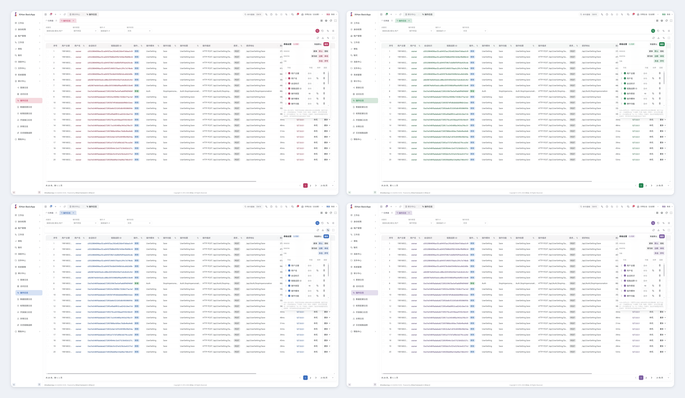
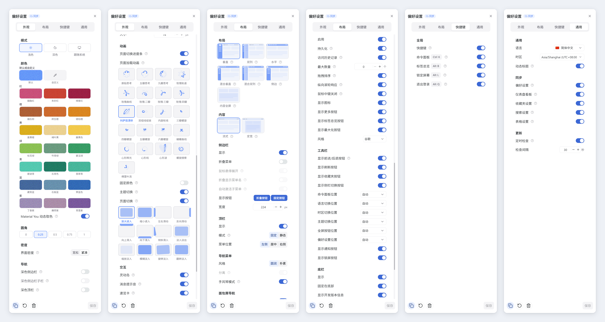
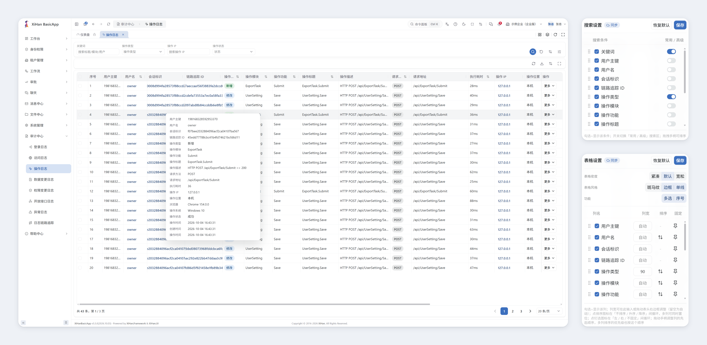
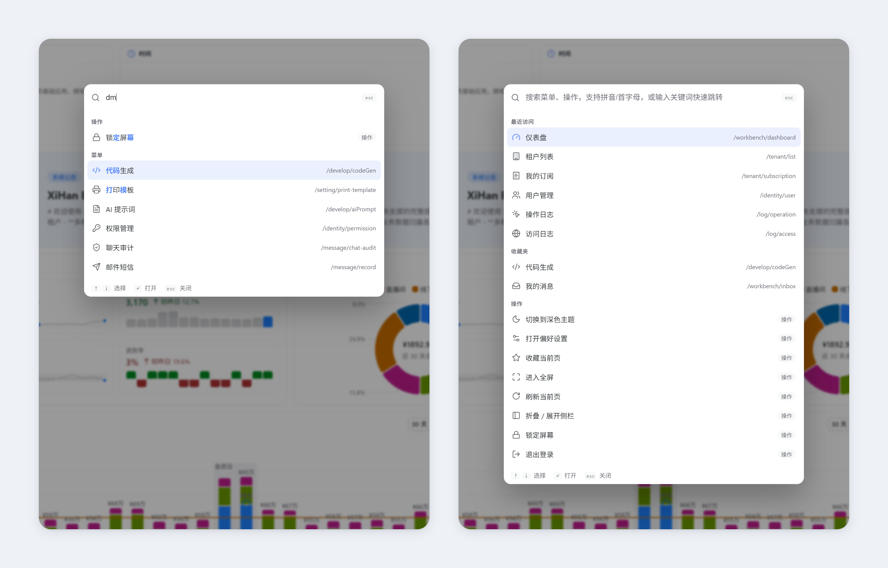
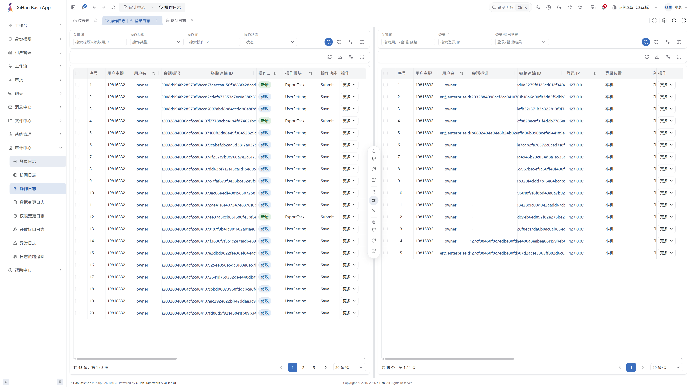
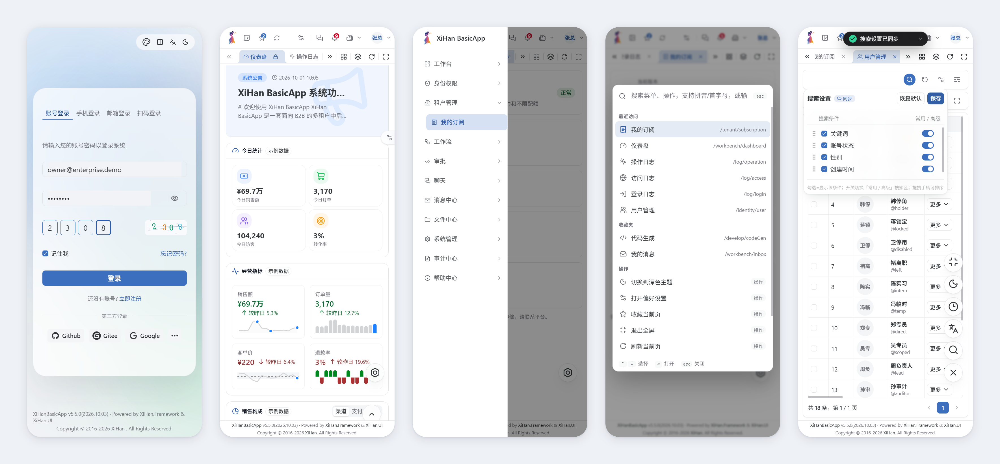
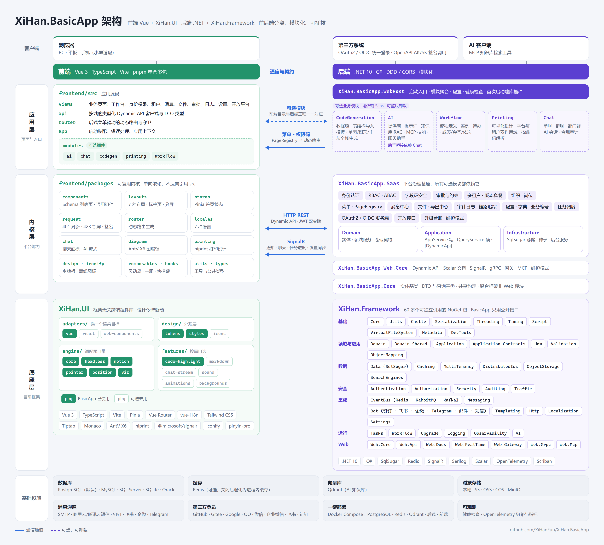

<div align="center">



<h1>XiHan.BasicApp</h1>

<p><b>基于 XiHan.Framework 和 XiHan.UI 的超高颜值通用中后台内核</b></p>

<p>后端基于 .NET 与 <a href="https://github.com/XiHanFun/XiHan.Framework">XiHan.Framework</a>，前端基于 Vue 与 <a href="https://github.com/XiHanFun/XiHan.UI">XiHan.UI</a><br/>多租户 · RBAC + 数据范围 + 字段脱敏 · 代码生成 · 实时通信</p>

<p><a href="./README.md">English</a> | <b>简体中文</b></p>

<p>
  <a href="https://github.com/XiHanFun/XiHan.BasicApp/stargazers"></a>
  <a href="https://gitee.com/XiHanFun/XiHan.BasicApp"></a>
  <a href="https://gitcode.com/XiHanFun/XiHan.BasicApp"></a>
</p>


<p>
  
  <a href="https://github.com/XiHanFun/XiHan.Framework"></a>
  
  
  
  
  <a href="https://www.nuget.org/packages?q=XiHan.BasicApp"></a>
</p>

<p>
  <a href="./LICENSE"></a>
  <a href="https://github.com/XiHanFun/XiHan.BasicApp/commits"></a>
  
  <a href="https://github.com/XiHanFun/XiHan.BasicApp/issues"></a>
  <a href="https://github.com/XiHanFun/XiHan.BasicApp/graphs/contributors"></a>
  
</p>

<p>
  <a href="https://deepwiki.com/XiHanFun/XiHan.BasicApp"></a>
  <a href="https://basicapp.docs.xihanfun.com"></a>
  <a href="https://qm.qq.com/q/qYp1Urv3z2"></a>
</p>
<p>
  <a href="https://trendshift.io/repositories/83127?utm_source=trendshift-badge&amp;utm_medium=badge&amp;utm_campaign=badge-trendshift-83127" target="_blank" rel="noopener noreferrer"></a>
</p>


</div>

## 简介

XiHan.BasicApp 采用前后端分离架构。后端遵循 DDD 分层，写路径走应用服务、读路径走查询服务，应用服务经动态 API 直接暴露为 REST 接口；前端使用 Vue + TypeScript + XiHan.UI，后端使用 .NET + XiHan.Framework。系统内置完整的身份、权限、租户与审计能力，既可作为中后台项目的起点，也可作为 .NET + Vue 全栈实践的参考。属于曦寒懿（XiHanFun）开源生态的基础应用。

## 文档

| 去处 | 内容 |
| --- | --- |
| [文档站](https://basicapp.docs.xihanfun.com) | 完整指南与逐主题专题文档 |
| [后端工程说明](./backend/README_cn.md) | 分层结构、工程清单、接口暴露、依赖构成、本地开发 |
| [前端工程说明](./frontend/README_cn.md) | 技术栈、monorepo 结构、架构约束、本地开发 |

## 预览

与[功能亮点](#功能亮点)对应；想直接上手可打开[在线演示](https://basicapp.xihanfun.com)。

<table>
  <tr>
    <td align="center" width="50%"><a href="./assets/preview/theme-light-dark.png"></a><br/><b>亮 / 暗双主题</b><br/>每个页面、每个组件逐一对过色</td>
    <td align="center" width="50%"><a href="./assets/preview/theme-colors.png"></a><br/><b>一个色值生成整套配色</b><br/>Material You 动态取色，21 个中国传统色预设</td>
  </tr>
  <tr>
    <td align="center" colspan="2"><a href="./assets/preview/preference-center.png"></a><br/><b>偏好中心</b><br/>布局、配色、密度、快捷键与云端同步一处调好，另一台设备实时生效</td>
  </tr>
  <tr>
    <td align="center" width="50%"><a href="./assets/preview/schema-list.png"></a><br/><b>Schema 驱动列表页</b><br/>行悬停速览、高级搜索、列设置开箱即用</td>
    <td align="center" width="50%"><a href="./assets/preview/command-palette.png"></a><br/><b>命令面板式全局搜索</b><br/><code>Ctrl / ⌘ + K</code> 呼出，拼音首字母直达页面与操作</td>
  </tr>
  <tr>
    <td align="center" width="50%"><a href="./assets/preview/split-view.png"></a><br/><b>应用内分屏</b><br/>两个页面左右并排，互换不重载</td>
    <td align="center" width="50%"><a href="./assets/preview/control-center.png"></a><br/><b>多租户控制中心</b><br/>平台管理与各租户之间一处切换</td>
  </tr>
  <tr>
    <td align="center" colspan="2"><a href="./assets/preview/mobile.png"></a><br/><b>小屏适配</b><br/>登录、仪表盘、抽屉菜单、命令面板与灵动岛，手机浏览器打开即可使用</td>
  </tr>
  <tr>
    <td align="center" width="50%"><a href="./assets/preview/dashboard.png"></a><br/><b>工作台</b><br/>小组件拖拽排布，看板布局云端保存</td>
    <td align="center" width="50%"><a href="./assets/preview/log-trace.png"></a><br/><b>一个 TraceId 看全链路</b><br/>七类日志串成时间线，桑基图看流向</td>
  </tr>
</table>

## 功能亮点

内置近 90 张表、50 多个页面与 300 多个权限码。这里只挑与众不同的地方，逐页面的能力清单见文档站[功能清单](https://basicapp.docs.xihanfun.com/features)；AI、在线聊天、代码生成、工作流和打印属于可选模块。

### 交互体验

- **亮 / 暗双主题**：不是简单加个 class，每个页面、每个组件都逐一对过色；切换时从点击处圆形扩散过渡
- **一个色值生成整套配色**：21 个中国传统色预设外加任意自定义色，Material You 动态取色从品牌色派生辅色、容器色和带色相的中性色，换主题色不用改一行 CSS
- **偏好中心**：7 种布局、圆角、紧凑度、字号、标签页样式、页面过渡与水印都可调；偏好、列设置、搜索习惯和工作台看板同步到云端，另一台设备实时生效
- **灵动岛反馈**：借手机交互思路，把登录、上传、导出、服务端异步任务进度和断线重连收拢到顶部小岛，进度环与重试按钮就在岛内，不再堆一屏 toast
- **Schema 驱动列表页**：全站近 50 个列表页由一份字段配置生成，列设置、高级搜索、多列排序、行悬停速览、树形、列宽拖拽和导入导出开箱即用
- **命令面板式全局搜索**：`Ctrl / ⌘ + K` 呼出，拼音与首字母模糊匹配，直达任意有权限的页面，也能直接切主题、锁屏、收藏当前页
- **应用内分屏**：两个页面左右并排、互换不重载；标签页可固定、拖拽排序，`Alt + B` 打开总览按拼音检索
- **小屏适配**：窄屏下侧栏自动收成抽屉、操作按钮只留图标、聊天切为单栏，手机浏览器打开即可使用
- **有来处的动效**：弹窗从触发它的按钮或表格行里展开，收藏时页签飞进收藏夹，系统开启减少动效时自动关闭
- **多语言与时区**：简中、繁中、英、日、韩、印地、德 7 种语言前后端一并覆盖，时间按用户所选时区换算

### 权限与安全

- **会话由服务端说了算**：每个请求读取服务端权限快照而不信任令牌里的声明，撤权、踢下线即刻生效；锁屏期间请求一律返回 423，解锁即可继续而不必重新登录
- **字段级安全**：按角色、用户或部门控制字段的可读、可改与脱敏方式（隐藏、全掩码、部分掩码、哈希、抹除），服务端统一执行、导出同样生效；被脱敏的字段不能排序筛选，杜绝从结果顺序反推明文
- **角色继承与职责分离**：角色只存直接继承关系、自动推导全图，父角色的拒绝向下生效；赋角色、改继承、批准申请时自动校验静态职责分离，冲突直接拦截
- **限时委托与权限申请**：委托必须设到期时间、可随时撤销；申请批准后自动授予对应角色或权限
- **带护栏的模拟登录**：必须填写原因，默认 30 分钟到期，期间屏蔽高危权限，全程审计并常驻提示横幅
- **认证一站配齐**：账号密码、邮箱短信验证码、TOTP 双因素，GitHub、Gitee、Google、QQ、微信、企业微信、飞书、钉钉 8 家第三方登录，账号 + IP 与单 IP 两级节流
- **自带 OAuth2 / OIDC 服务端**：授权码 + PKCE、令牌吊销、发现文档与 JWKS，可直接做自家系统的统一登录中心；开放接口另有 AK / SK 签名凭证
- **菜单、路由、权限码只有一份真源**：后端 PageRegistry 一处登记页面、路由、组件、权限码和按钮，菜单种子与前端路由都由它派生，测试核对前后端是否一致

### 多租户

- **两种隔离任选**：默认按字段隔离，也可给单个租户分配独立数据库（PostgreSQL、MySQL、SQL Server、SQLite、Oracle），分步完成建库与管理员初始化
- **全局数据防误写**：平台数据统一 `TenantId = 0`，租户只读不可写，写守卫落在框架数据层
- **套餐可直接售卖**：免费、基础、专业、企业四档版本以权限白名单门控功能，降级自动回收越界授权；席位与存储配额在加人、上传时强制校验
- **平台代运维**：平台可派运维支持成员进入租户，租户所有权可转移，到期由后台任务自动停用

### 审计与运维

- **七类审计日志**：访问、开放接口、操作、异常、登录、数据变更、权限变更全覆盖，落库前自动脱敏密码与令牌，按月分表、定期清理
- **一个 TraceId 看全链路**：七类日志按 TraceId、会话、用户或 IP 串成一条时间线，桑基图看流向、堆叠图看时间分布
- **数据变更逐字段留痕**：新增、修改、删除、恢复都记录字段前后差异与风险等级
- **可靠的消息投递**：站内信、邮件、短信、机器人四渠道任意组合，模板可按租户覆盖；Outbox 原子认领、失败重试、崩溃恢复，SignalR 实时推送
- **异步导出不越权**：导出中心以发起人身份在后台执行，字段脱敏照样生效，进度经灵动岛实时回推
- **业务编号不重号**：幂等键 + 请求指纹防重复发号，乐观锁保证并发安全，支持批量取号与按时区重置
- **升级有台账**：前向 SQL 脚本按版本逐库登记执行状态、耗时与错误，升级期间维护模式返回 503 与 `Retry-After`

### 可选模块

- **模块按需取舍**：AI、在线聊天、代码生成、工作流、打印各是后端一个工程对应前端一个目录，不需要的整块拿掉（步骤见[卸载可选模块](#卸载可选模块)）
- **代码生成**：单表、树形、主从三种模式，一次产出实体、DTO、API、前端页面以及权限码、菜单、导出与打印数据源；生成代码与手写代码分文件，重新生成不覆盖手改
- **工作流**：基于 AntV X6 的可视化设计器，16 种节点，或签、会签、依次审批与转办、加签；状态落库、宕机可恢复，实例图按节点状态着色
- **打印设计器**：拖入字段、绑定后端数据源与样例数据，所见即所得；配合桌面客户端可静默直打
- **在线聊天**：单聊、群聊、部门群，撤回、编辑、回复、@、表情回应、群已读回执、语音消息与敏感词拦截，还能与流式 AI 助手对话，配套合规审计
- **AI 知识库**：基于 Qdrant 的 RAG 问答带来源引用、按租户隔离，模型提供商库化管理、可热切换

### 工程底座

- **不写 Controller**：150 多个应用服务经动态 API 直接暴露为 REST，写走 AppService、读走 QueryService，Scalar 在线文档
- **架构约束有测试兜底**：2700 多个测试用例，连实体落在哪个库、唯一索引是否带租户范围、页面是否硬编码权限码都有结构性测试
- **底座可以单独带走**：后端底座 XiHan.Framework 拆为 60 多个可独立引用的 NuGet 包，BasicApp 只用公开接口，先用模板上线、再逐块换成自己的实现

## 技术栈

后端 .NET + XiHan.Framework（SqlSugar / Redis / SignalR / Serilog / Scalar 均由框架带入）；前端 Vue + TypeScript + Vite + XiHan.UI + Pinia + Tailwind CSS。

逐项清单见[后端工程说明](./backend/README_cn.md#依赖构成)与[前端工程说明](./frontend/README_cn.md#技术栈)。

## 架构

前后端各分三层并横向对齐：应用层放页面与入口，内核层放平台能力，底座层是自研的 XiHan.UI 与 XiHan.Framework。后端每个模块内部遵循 DDD 分层（Domain / Application / Infrastructure），前后端之间通过 Dynamic API、SignalR 和后端下发的菜单与权限码协作。

<p align="center"><a href="./assets/architecture_cn.png"></a></p>

后端工程一览：

| 项目 | 说明 | 可卸载 |
| --- | --- | --- |
| `XiHan.BasicApp.Core` | 应用基座，聚合框架的非 Web 模块与全应用共享约定 | 否 |
| `XiHan.BasicApp.Web.Core` | Web 侧基座，聚合框架 Web 模块，提供维护模式中间件 | 否 |
| `XiHan.BasicApp.Saas` | 平台治理模块：用户 / 角色 / 权限 / 菜单 / 部门 / 租户 / 配置 / 字典 / 文件 / 通知 / 审批 / 日志 / 任务 | 否 |
| `XiHan.BasicApp.CodeGeneration` | 代码生成：数据源管理 / 表结构导入 / 模板配置 / 全栈生成 | 是 |
| `XiHan.BasicApp.AI` | AI 能力：提供商与密钥管理 / 提示词库 / 知识库 RAG / AI 技能（MCP 工具）/ 聊天 AI 助手 | 是（助手桥接依赖 Chat） |
| `XiHan.BasicApp.Workflow` | 工作流引擎落地：流程定义 / 实例 / 待办（框架引擎的持久化与 API） | 是 |
| `XiHan.BasicApp.Printing` | 打印模板：可视化设计 / 租户与平台双作用域 / 按编码解析 | 是 |
| `XiHan.BasicApp.Chat` | 在线聊天：单聊 / 群聊 / 部门群 / AI 助手会话 / 实时推送 / 合规审计 | 是（删除须连带处理 AI 的助手桥接） |
| `XiHan.BasicApp.WebHost` | 启动入口，聚合所有模块 | — |

```text
XiHan.BasicApp/
├── backend/                 # 后端（.NET）
│   ├── src/
│   │   ├── framework/       #   Core / Web.Core 基础能力
│   │   ├── modules/         #   Saas + 可选模块（CodeGen/AI/Workflow/Printing/Chat）
│   │   └── main/            #   WebHost 启动入口
│   ├── props/               #   共享 MSBuild 属性
│   ├── scripts/             #   版本号与清理脚本
│   └── test/                #   测试项目
├── frontend/                # 前端（Vue + XiHan.UI）
│   ├── src/                 #   应用源码（src/modules/ 与后端可选模块一一对应）
│   └── packages/            #   内部包
└── assets/                  # 品牌与 README 资源
    ├── architecture.html    # 架构图源文件（导出 architecture*.png）
    └── preview/             # 功能预览截图
```

### 卸载可选模块

一个可选模块 = 后端一个工程 + 前端一个 `src/modules/<模块>` 目录。后端与前端各自的卸载步骤见[后端工程说明](./backend/README_cn.md#卸载可选模块)与[前端工程说明](./frontend/README_cn.md#卸载可选模块)。

⚠️ **卸载必须伴随重建数据库**：菜单、权限、角色授权、定时任务的种子行不会随模块删除自动回收。

## 快速开始

### 环境要求

| 依赖 | 版本 | 说明 |
| --- | --- | --- |
| .NET SDK | 10.0+ | 后端必需 |
| Node.js | 24.0+ | 前端必需 |
| pnpm | 11.0+ | 前端必需 |
| PostgreSQL | 14+ | 唯一硬依赖，也可用 MySQL / SQL Server / SQLite / Oracle |
| Redis | 6.0+ | 可选，关闭后退化为进程内内存缓存 |
| Qdrant | v1.15+ | 仅启用 AI 知识库时需要 |

### 容器一键起

仓库根自带 `docker-compose.yml`，包含 PostgreSQL、Redis、Qdrant、后端与前端五个服务：

```bash
cp .env.example .env
docker compose up -d
```

默认前端 `http://localhost:8080`、后端 `http://localhost:9708`，端口可在 `.env` 里改。

### 后端

```bash
git clone https://github.com/XiHanFun/XiHan.BasicApp.git
cd XiHan.BasicApp/backend

dotnet run --project src/main/XiHan.BasicApp.WebHost --launch-profile Development
```

启动后访问 `http://127.0.0.1:9708/scalar` 查看 API 文档。各环境端口：Development `9708`、Production `9709`。

连接串配在 `backend/src/main/XiHan.BasicApp.WebHost/appsettings.Development.json` 的 `XiHan:Data:SqlSugarCore:ConnectionConfigs`。首次启动会自动建库建表并播种。

框架默认走 NuGet 包，克隆本仓即可编译；连框架一起改的方式见[后端工程说明](./backend/README_cn.md#框架引用方式)。

### 前端

```bash
cd frontend
pnpm install
pnpm dev
```

> `@xihan-ui/*` 取 npm 上的正式版，单独 clone 本仓即可 `pnpm install`，不需要并列检出 `XiHan.UI`。要连组件库源码一起调试，临时在 `pnpm-workspace.yaml` 加 `overrides` 指到 `link:../../XiHan.UI/ui/packages/*`，调完删掉、不要提交。

### 默认账号

初始超级管理员账号为 `superadmin`，密码 `SuperAdmin@123`（写在种子里，账号标记为需要本人改密）。生产环境首次登录后请立即修改，并建议在参数「密码设置」里开启强制改密。

开发环境默认开启演示数据（`Saas:Seed:EnableDemoData`）：覆盖各种套餐、租户状态、成员类型、数据范围与账号状态的演示租户和账号，密码都是 `Demo@123`，清单见[框架简介：种子数据](docs/backend/introduction.md#演示数据)。

## 项目生态

- [XiHan.Framework](https://github.com/XiHanFun/XiHan.Framework) - 快速、轻量、高效、用心的 .NET 现代模块化开发框架
- [XiHan.UI](https://github.com/XiHanFun/XiHan.UI) - 快速、轻量、高效、用心的框架无关跨端组件库
- [XiHan.BasicApp](https://github.com/XiHanFun/XiHan.BasicApp) - 基于 .Net + Vue 的超高颜值中后台内核

## 诚挚致谢

排名不分先后。

| 项目                                                         | 致谢                                           |
| ------------------------------------------------------------ | ---------------------------------------------- |
| [XiHan.Framework](https://github.com/XiHanFun/XiHan.Framework) | 作为本项目的后端底层框架支持                   |
| [XiHan.UI](https://github.com/XiHanFun/XiHan.UI)             | 作为本项目的前端视图组件支持                   |
| [NaiveUI](https://github.com/tusen-ai/naive-ui)              | 作为本项目的前端视图组件支持（v4.0.0前）       |
| [Blog.Core](https://github.com/anjoy8/Blog.Core)             | 作为部分后端架构、逻辑功能灵感来源（启蒙项目） |
| [ Admin.Core.ZR](https://gitee.com/izory/ZrAdminNetCore)     | 作为部分后端功能灵感来源                       |
| [YuebonCore](https://gitee.com/yuebon/YuebonNetCore)         | 作为部分后端功能灵感来源                       |
| [VbenAdmin](https://github.com/vbenjs/vue-vben-admin)        | 作为部分前端架构、视觉功能灵感来源（启蒙项目） |
| [SoybeanAdmin](https://github.com/soybeanjs/soybean-admin)   | 作为部分前端视觉功能灵感来源                   |
| [LitheAdmin](https://github.com/tenianon/lithe-admin)        | 作为部分前端视觉功能灵感来源                   |
| 其他第三方依赖                                               | 作为项目功能丰富与拓展的基石                   |


## 支持&赞助

如果此项目对你的开发有助益，也欢迎请作者一杯咖啡。

官方赞助页 https://docs.xihanfun.com/cosmos/sponsor


## 版权&授权

Copyright (c) 2021-Present XiHanFun and contributors.

本项目采用 MIT 授权，详见 [License](./LICENSE)

XiHan.BasicApp Logo、XiHan.BasicApp名称、界面视觉设计与原创视觉表达归作者所有，第三方依赖和第三方服务分别遵循其各自授权与服务条款。

项目仅供学习参考，作者不承担任何软件的使用风险。
