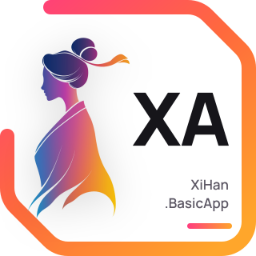

[中文](README_cn.md)

# XiHan.BasicApp Backend

This file is for backend developers and contributors. It documents **how this layer is organized**: structure, project catalog, how endpoints are exposed, the dependency footprint and local development.

If you just want to get the whole system running, start from the [repository README](../README.md); topic-by-topic documentation lives on the [documentation site](https://basicapp.docs.xihanfun.com).

## Architecture Overview

Three layers, dependencies flow upwards only, never back:

```text
src/main/       XiHan.BasicApp.WebHost          the only executable project
      ↑
src/modules/    Saas · CodeGeneration · AI      six business modules
                Workflow · Printing · Chat      depend on Saas or Web.Core only
      ↑
src/framework/  XiHan.BasicApp.Core             the only two projects referencing
                XiHan.BasicApp.Web.Core         XiHan.Framework
```

`Saas` is the base module — identity, permissions, multi-tenancy, auditing and platform capabilities. The other five are optional and can be removed as a whole.

## Project Catalog

9 source projects and 10 test projects, 19 csproj files in total, all registered in `XiHan.BasicApp.slnx` (`.slnx` format, not `.sln`).

| Project | Responsibility |
| --- | --- |
| `XiHan.BasicApp.Core` | Application base: composes the non-web framework modules and the shared types and conventions |
| `XiHan.BasicApp.Web.Core` | Web base (`Microsoft.NET.Sdk.Web`): composes six framework web modules, provides maintenance mode (state flag + 503/`Retry-After` middleware, passing through `/health` and `/.well-known/`) |
| `XiHan.BasicApp.Saas` | Base business module: authentication, RBAC with data scopes and field masking, multi-tenancy, six kinds of audit log, message center, export center, scheduled jobs, open platform |
| `XiHan.BasicApp.CodeGeneration` | Code generation: DbFirst schema import, single-table / tree / master-detail modes, Scriban templates, derived artifact generators |
| `XiHan.BasicApp.AI` | AI: provider and API-key custody, prompt library, Qdrant knowledge-base RAG, skill registry with MCP projection, configurable assistants |
| `XiHan.BasicApp.Workflow` | Workflow: the framework engine plus SqlSugar persistence (replacing the in-memory default), definition / instance / todo application services |
| `XiHan.BasicApp.Printing` | Printing: hiprint template management; template codes are unique per tenant and immutable after creation; data sources come from a code-registered registry |
| `XiHan.BasicApp.Chat` | Chat: single / group / department / assistant conversations, realtime delivery, sensitive-word filtering, retention cleanup |
| `XiHan.BasicApp.WebHost` | Startup host: module composition, middleware pipeline, health checks, seeding and upgrade entry points |

## Endpoint Exposure

**No controllers at all.** 159 types are annotated with `[DynamicApi]` and get their routes registered automatically by the framework's dynamic API convention:

| Module | Dynamic API types |
| --- | --- |
| Saas | 121 |
| CodeGeneration | 12 |
| AI | 11 |
| Workflow | 7 |
| Chat | 4 |
| Printing | 4 |

One constraint is enforced by tests: every dynamic API method must be covered by `PermissionAuthorizeAttribute`, `AllowAnonymousAttribute` or an explicit allowlist — forgetting authorization fails the test run.

A few endpoints are neither HTTP-dynamic-API nor plain HTTP: the SignalR notification hub and chat hub; the OAuth external-login callbacks `/api/OAuth/ExternalLogin` and `/api/OAuth/Callback`; and the OIDC provider endpoints `/connect/authorize`, `/connect/token`, `/connect/revoke` plus discovery, JWKS and userinfo (not registered when disabled).

## Data Model

89 tables (`SugarTable`): Saas 71, CodeGeneration 5, AI 4, Chat 4, Workflow 4, Printing 1.

## Dependency Footprint

- **63 XiHan.Framework packages** (`4.0.0`): 56 referenced by Core, 7 by Web.Core
- **Exactly one third-party NuGet package on the source side**: `Microsoft.SemanticKernel.Connectors.Qdrant` (for the AI knowledge base)
- SqlSugar, Serilog, the Redis client and Scriban all arrive transitively through the framework; SignalR and MVC come from the ASP.NET Core shared framework
- Five third-party packages on the test side: xunit, xunit.runner.visualstudio, Microsoft.NET.Test.Sdk, Moq, coverlet.collector

### How the Framework Is Referenced

`props/framework.props` decides whether the framework is consumed **from source** or **from NuGet**: `UseXiHanFrameworkSource` defaults to true when the **solution name starts with `XiHanFun`** and the framework's Core csproj exists; otherwise NuGet is used. Override it explicitly with `-p:UseXiHanFrameworkSource=true` / `false`. Building a single csproj leaves the solution name empty and therefore resolves to NuGet — which is exactly what the container build relies on. Only `Core` and `Web.Core` import this file.

## Local Development

```bash
dotnet restore backend/XiHan.BasicApp.slnx
dotnet build backend/XiHan.BasicApp.slnx --configuration Release
dotnet test backend/XiHan.BasicApp.slnx --configuration Release
```

Run `src/main/XiHan.BasicApp.WebHost`. Development listens on `http://127.0.0.1:9708` (with `launchUrl` pointing at the scalar docs page), Production on `:9709`; both can be overridden through the `Hosting:Urls` setting.

`scripts/` contains just two scripts: `nuget/VersionUpgrade.ps1` (bumps the version in `props/version.props`) and `project/ClearProjecBinObj.ps1` (clears bin/obj).

## Configuration and External Dependencies

| File | Notes |
| --- | --- |
| `appsettings.json` | A handful of environment-independent defaults |
| `appsettings.Development.json` | The full annotated reference configuration; add new settings here first |
| `appsettings.Production.json` | **Ignored by `.gitignore` and absent from the repository** — copy it from the Development one and adapt |

Configuration sections: `XiHan:{Observability, DistributedIds, Authentication, Data, Upgrade, Caching, Web, Localization, VirtualFileSystem, ObjectStorage}`.

External dependencies:

- **Database** — the only hard requirement, PostgreSQL by default; connections support SqlServer / MySql / PostgreSQL / SQLite / Oracle
- **Redis** — optional. Turn it off and caching falls back to in-process memory; the health check still reports Healthy, annotated as "not enabled (in-process fallback)"
- **Qdrant** — only needed for the AI knowledge base. The app starts without it, but `/health` turns red and the knowledge base is unavailable

`GET /health` is anonymous and returns the overall status plus the names of the three checks (database / redis / qdrant). It deliberately does not return connection strings or exception details.

## First Start

`EnableDbInitialization`, `EnableTableInitialization` and `EnableDataSeeding` all default to **true**: point the app at an empty database it can reach and it will create the schema and seed it on startup. Seeds come in two kinds — the system baseline always runs, while demo data is controlled by `Saas:Seed:EnableDemoData` (only skipped when explicitly set to false).

Default super administrator: username `superadmin`, email `superadmin@xihan.fun`, role code `super_admin`, built-in default password `SuperAdmin@123`. Override it with the `Saas:Seed:SuperAdminPassword` setting (environment variable `Saas__Seed__SuperAdminPassword`); keeping the built-in default logs a warning on startup.

## Upgrade Scripts

The repository convention is `UpdateScripts/<version>/<version>.sql`, currently six version directories (3.10.0, 3.10.1, 3.12.1, 3.13.0, 4.0.1, 4.0.2). By convention only the PostgreSQL dialect is provided, and each script must be safe to re-run (`IF NOT EXISTS` and friends).

These scripts are **not executed automatically on startup** — apply them to the target database yourself, in version order.

## Tests

10 test projects and 2301 `[Fact]` / `[Theory]` annotations (Saas 652, CodeGeneration 510, AI 306, Workflow 216, Chat 206, Printing 203, Core 84, Web.Core 56, WebHost 55, Api 13). All of them are unit tests and reflection-based constraint tests; none touch a database.

## Container

`Dockerfile` is a two-stage build (`sdk:10.0` → `aspnet:10.0`) that copies only `props` and `src`, resolves the framework from NuGet, runs as a non-root user, exposes 9708 and ships a `HEALTHCHECK` against `/health`.

## Removing Optional Modules

The five optional modules (CodeGeneration / AI / Workflow / Printing / Chat) can be removed wholesale: delete the project and its test project, drop them from `XiHan.BasicApp.slnx`, and remove the module dependency registration on the WebHost side. Chat and AI have a one-way dependency, so removing Chat also means deleting the three assistant bridge files on the AI side.

⚠️ **Removal must be paired with rebuilding the database** — seeded menus, permission codes and tables are not reclaimed automatically.
